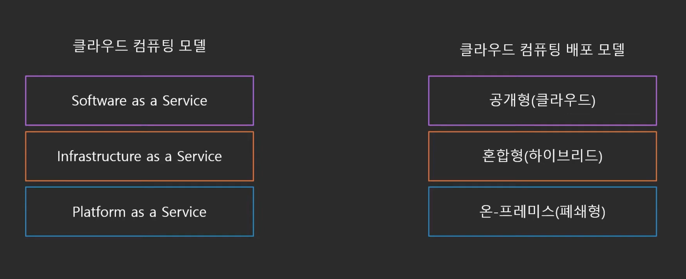
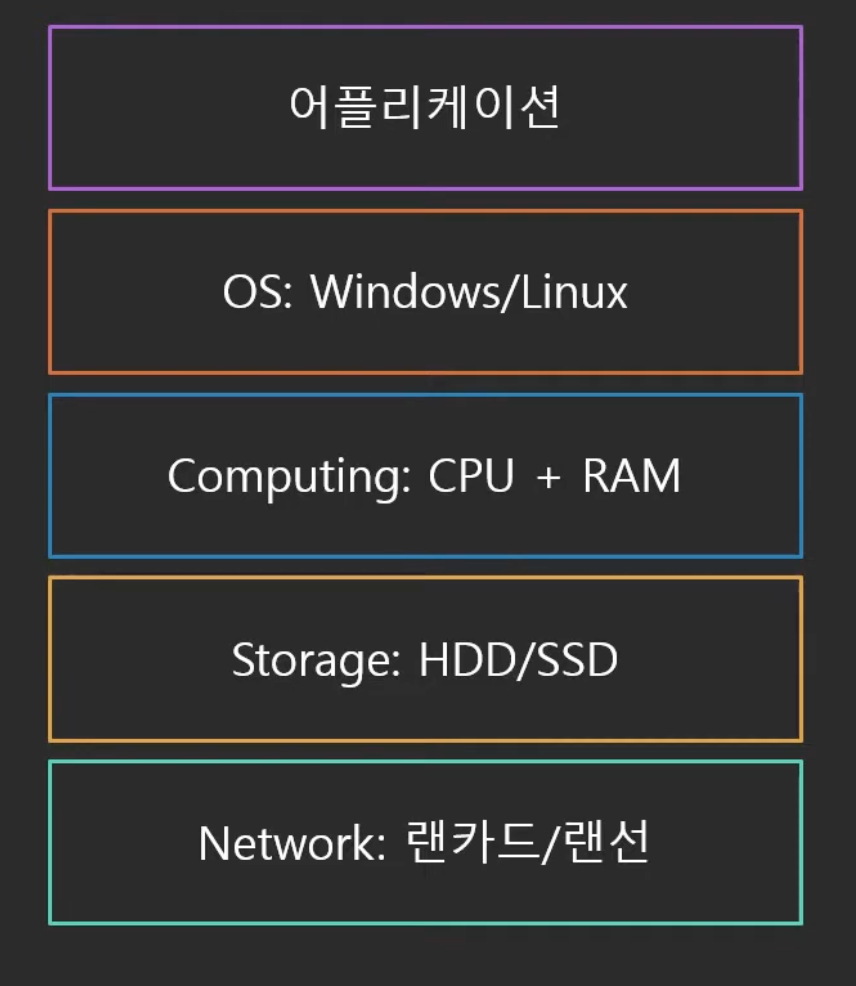
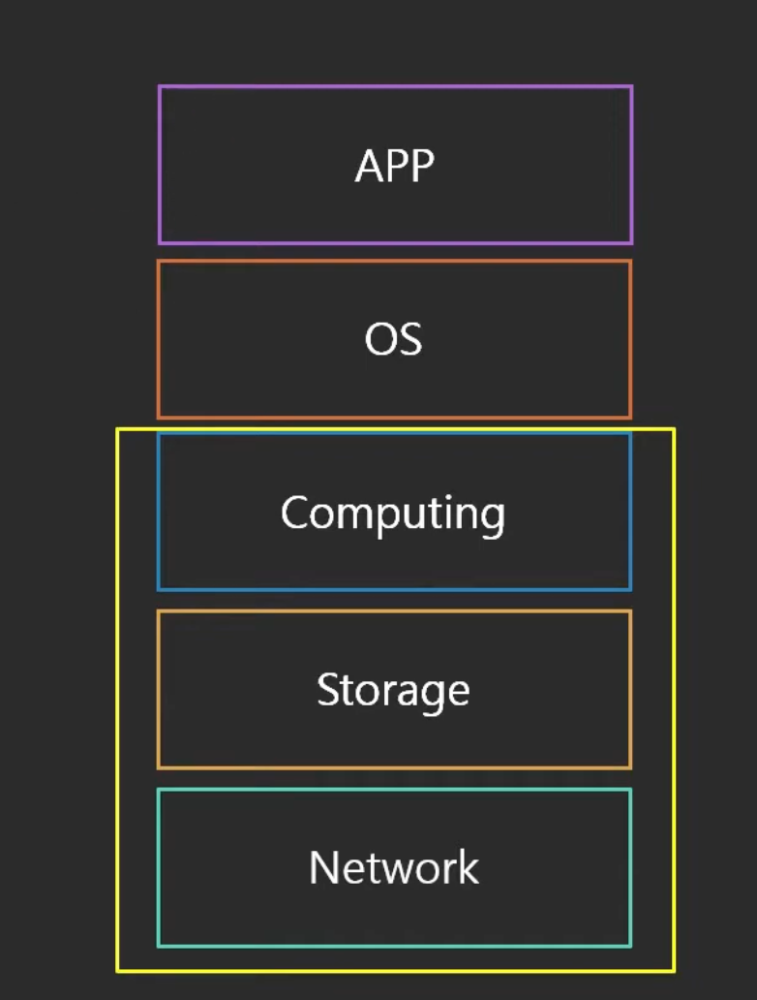
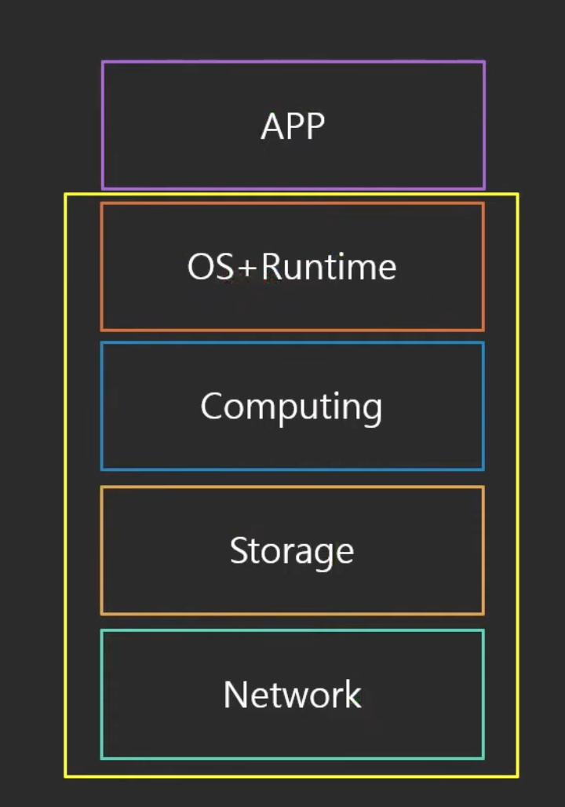
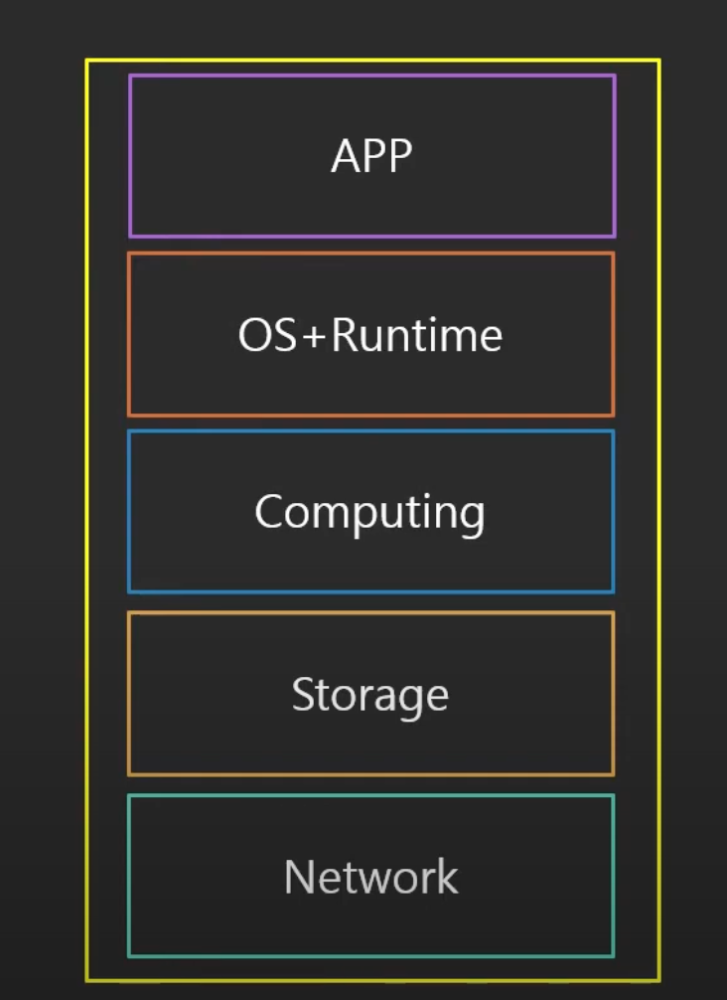

# 클라우드 컴퓨팅의 모델

### **어플리케이션의 구성**

## **클라우드 컴퓨팅 모델**

### **IaaS: Infrastructure as a Service**

- 인프라만 제공
- OS를 직접 설치하고 필요한 소프트웨어를 개발해서 사용함
    - Computing, Storage, Network 레이어는 제공, 나머지는 직접 설치
- 예: AWS EC2

### **PaaS: Platform as a Service**

- Computing, Storage, Network, 그리고 OS랑 APP을 실행하기 위한 Runtime도 제공
- 바로 코드만 올려서 돌릴 수 있도록 구성
- 예: Firebase, Google App Engine

### **SaaS: Software as a Service**

- 서비스 자체를 제공
- 다른 세팅 없이 서비스만 이용함
- 예: Gmail, DropBox, Slack, Google Docs

## **배포 모델**

**공개형 클라우드**

- 모든 부분이 클라우드에서 실행
- 낮은 비용
- 높은 확장성

**폐쇄형**

- 높은 수준의 커스터마이징이 가능함
- 초기 비용이 비쌈
- 유지보수 비용도 비쌈
- 높은 보안

**혼합형**

- 폐쇄형에서 공개형으로 전환하는 과도기에 사용
- 폐쇄형의 백업으로 사용되기도 함