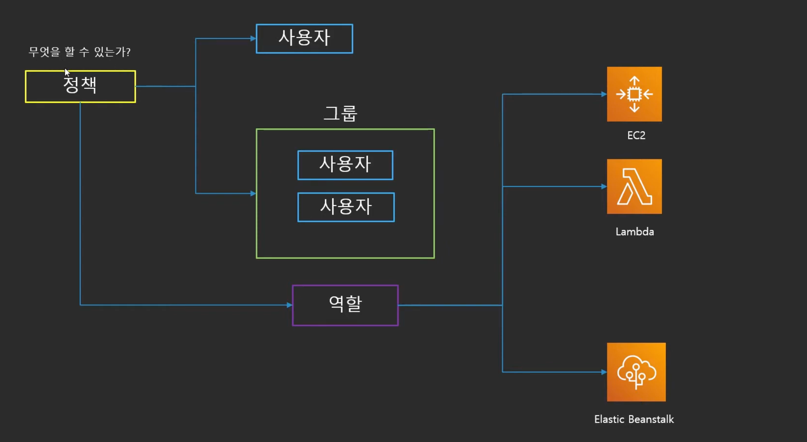
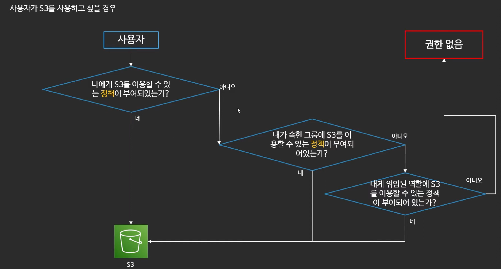
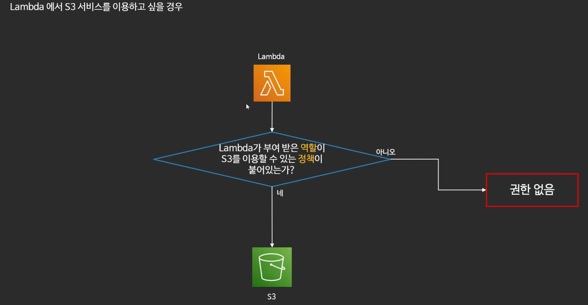
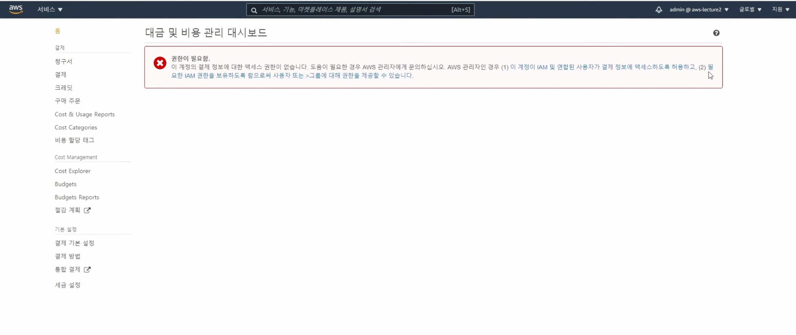

# IAM

## **IAM**

***AWS Identity and Access Management***

AWS 서비스와 리소스에 대한 엑세스를 안전하게 관리할 수 있다.

AWS 사용자 및 그룹을 만들고 관리하며 AWS 리소스에 대한 엑세스를 허용 및 거부할 수 있다.

- 서비스 사용을 위한 인증 정부 부여
- 사용자의 패스워드 정책 관리
    - 일정 시간마다 패스워드 변경 등
- 다른 계정과의 리소스를 공유함 → 페이스북 로그인, 구글 로그인 등
- 로그인 주소 생성 가능
- 글로벌 서비스

## **IAM의 4가지 요소 (구성)**

### 사용자

- 실제 AWS를 사용하는 사람 혹은 어플리케이션을 의미

### 그룹

- 사용자의 집합
- 그룹에 속한 사용자는 그룹에 부여된 권한을 행사
    - 그룹: 관리자, 개발1팀, 개발2팀, 회계팀 등

### 정책

- 사용자와 그룹, 역할이 무엇을 할 수 있는지에 관한 문서
    - 자세하게 짤 수 있음 → 언제 어떻게 무엇을 왜
- JSON 형식으로 정의

### 역할

- AWS 리소스에 부여하여 AWS 리소스가 무엇을 할 수 있는지를 정의
- 혹은 다른 사용자가 역할을 부여 받아 사용
- 다른 자격에 대해서 신뢰관계를 구축 가능
- 역할을 바꾸어 가며 서비스를 사용 가능

## **IAM의 권한 검증**

Lamda의 경우

## **사용자의 종류**

- **루트 사용자**: 결제 관리를 포함한 계정의 모든 권한을 가지고 있음
    - 관리 목적 이외에 다른 용도로 사용하지 않는 것을 권장
    - 탈취 되었을 때 복구가 매우 어려움 → MFA를 설정하는 것을 권장
        - MFA → Multi-factor authentication
- **IAM 사용자**: IAM을 통해 생성해서 사용하는 사용자
    - 한 사람 혹은 하나의 어플리케이션을 의미
    - 설정 시 콘솔 로그인 권한 부여 가능
    - 설정 시 AWS서비스를 이용할 수 있음
        - Access Key
        - Secret Access Key
    - AdminAccess를 부여하더라도 루트 사용자로 별도의 설정을 하지 않으면 Billing 기능을 사용할 수 없음
        
        
        

## **IAM을 어떻게 사용해야할까?**

- 루트 사용자는 사용하지 않기 
- 불필요한 사용자는 만들지 않기
    - 관리가 어려움
- 가능하면 그룹과 정책을 사용하기
- 최소한의 권한만을 허용해야함 (Principle of lease privilege)
- MFA를 활성화 하기
- AccessKey 대신 역할을 활용하기
- IAM 자격 증명 보고서 (Credential Report) 활용하기