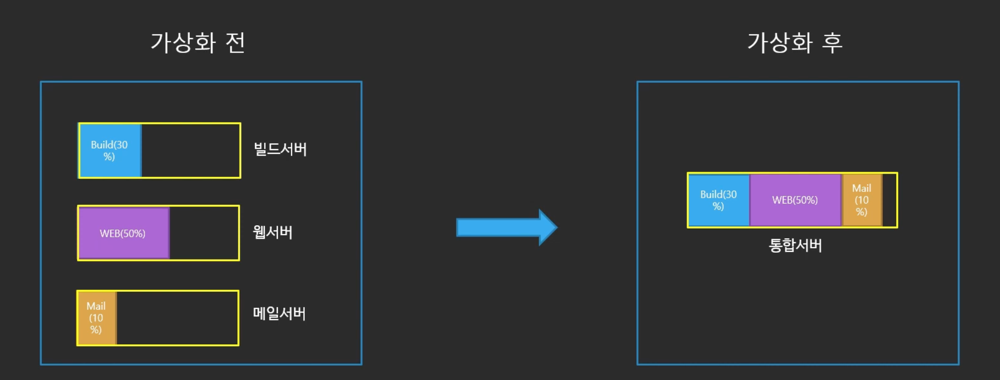
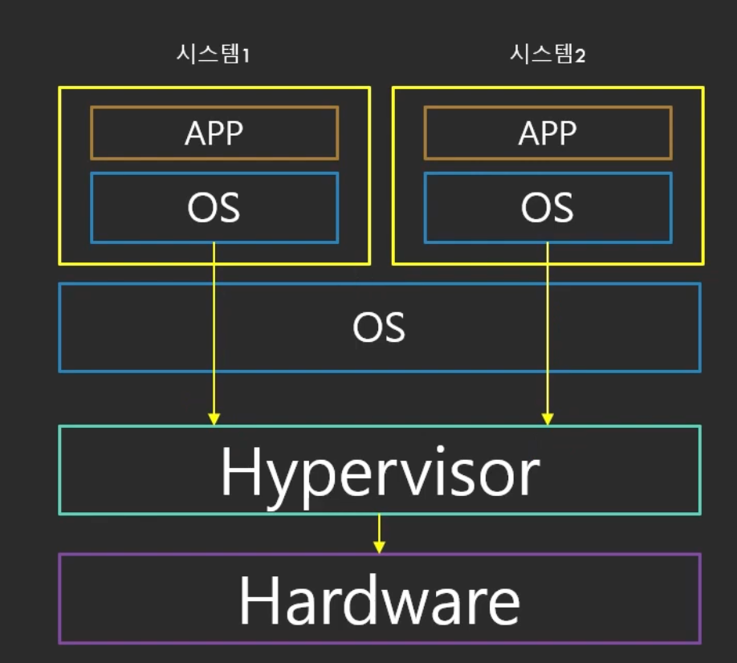
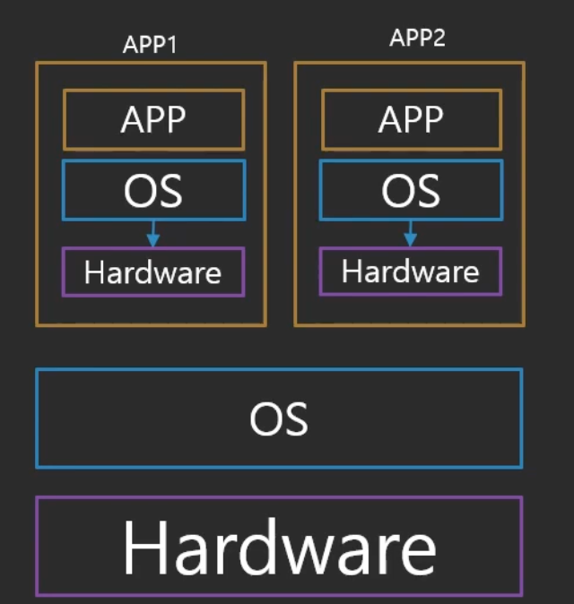
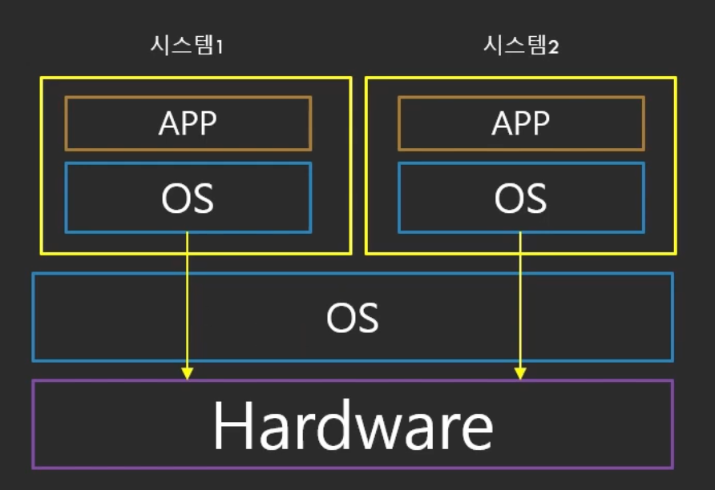

# 가상화 (virtualization)

하나의 컴퓨터를 다수의 가상 컴퓨터로 분할할 수 있도록 해주는 기술

위 경우 하나의 서버에 몰아서 넣으면 효율적으로 서버를 한대로 관리할 수 있음

가상화가 나타나기 전 까지는 하나의 하드웨어 시스템은 하나의 OS만 실행이 가능했다

- Bare-Metal: 일반적인 컴퓨터처럼 직접 OS가 하드웨어에 설치된 상태 → 가상화의 반대

# **가상화의 역사**

- **1세대: 완전 가상화 (Fully Emulated)**
    
    
    
    - 모든 시스템 요소가 에뮬레이터 안에서 돌아감
    - 즉 CPU, 하드디스크, 마더보드 등 모든 요소를 에뮬레이터로 구현하여 OS와 연동
    - 엄청 느림
- **2세대: Paravirtualization**
    
    
    
    - Guest OS는 하이퍼바이저와 통신
        - 하이퍼바이저: OS와 하드웨어 사이에 존재하는 일종의 가상화 매니저
    - 속도가 조금 향상됨
    - 몇 몇 요소의 경우 여전히 에뮬레이터가 필요함 → 느림
- **3세대: Hardware Virtual Machine (HVM)**
    
    
    
    - 하드웨어에서 직접 가상화를 지원
    - 직점 Guest-OS가 하드웨어와 통신 → 빠른 속도

## **가상화와 클라우드**

- AWS 클라우드 환경에서 리소스를 작은 단위로 빠르게 구성할 수 있는 원동력은 가상화
    - 사용자마다 컴퓨터를 할당해 주는 것이 아닌 이미 구축된 가상화 가능한 서버의 한 부분을 할당해 주는 것
- 가상화가 없이는 클라우드는 존재할 수 없다