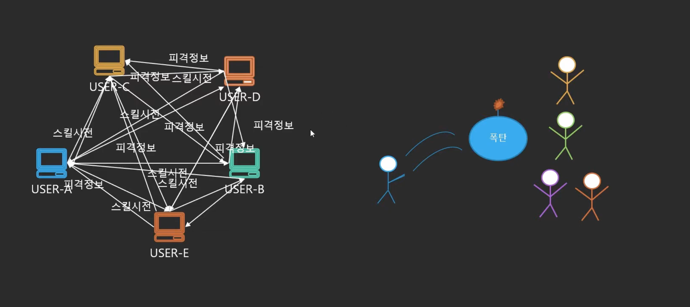
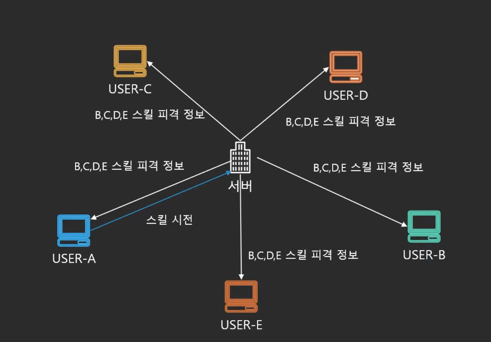
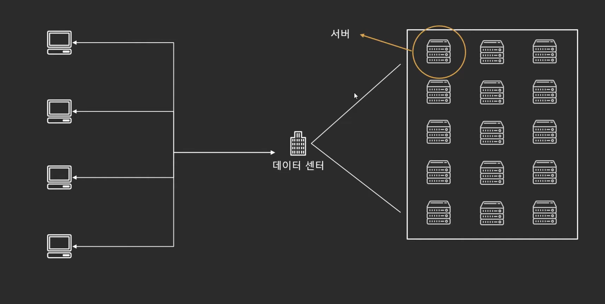
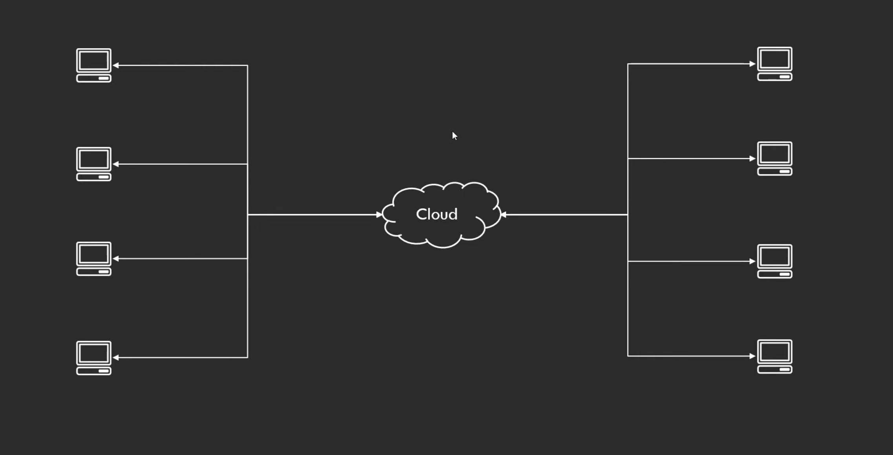
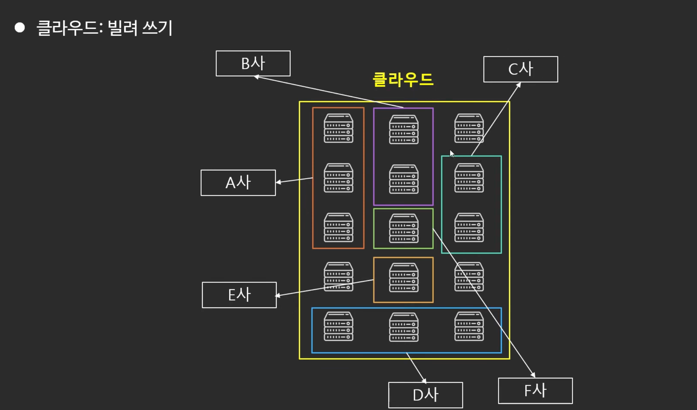

# 클라우드 컴퓨팅이란?

*클라우드 컴퓨팅은 IT 리소스를 인터넷을 통해 온디맨드로 제공하고 사용한 만큼만 비용을 지불함*

**서버 - 클라이언트 아키텍쳐**

복잡한 통신 → 부하 걸림

하나라도 안 맞는다면 굴러가지 않음

**효율적인 방법 → 서버**

**데이터 센터의 문제점**

- 운영에 비용이 많이 소요됨
    - 구매하면 수요에 상관없이 계속 보유해야 함
    - 유지보수, 서버 구매비용 등
- 느린 구축시간
    - 유저의 수요에 빠르게 대처하기 힘듬
    - 장애 기기를 교체하는 시간이 느림

클라우드의 장점

- 막대한 초기비용 대신 쓰는 만큼 비용 지불
- 규모의 경제로 얻는 이점
    - 한 개를 사는 것 보다 100개를 사는게 단가가 낮음 → 규모의 경제
    - 공동구매랑 같은 느낌
- 용량
    - 최대 피크로 구매하지만 피크에 도달하지 않을 때는 잉여 자원이 너무 많음
    - 수요에 반응해서 클라우드에서 사용한 만큼만 최적화함 → 불필요한 자원에서 오는 손해가 적음
- 속도
    - 바로 리소스를 확보 가능함
- 빠른 확장성
    - 전 세계에 서비스 가능